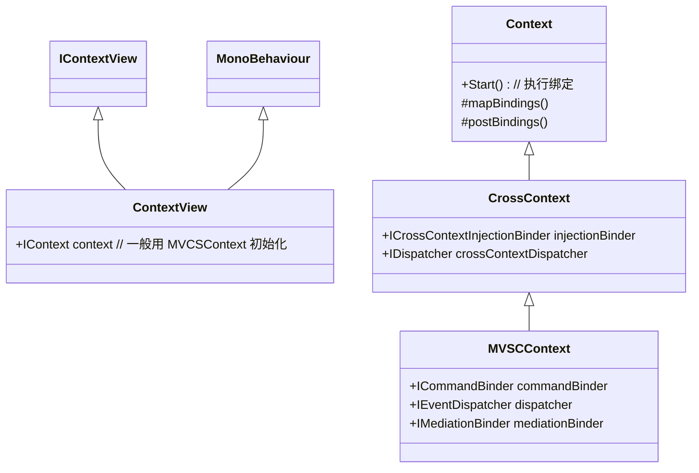

#todolist

- dispatcher 与 commandBinder 区别：commandBinder 同样会监听 dispatcher 发出的事件，区别在于 commandBinder 每次收到事件会新生成一个 command 来执行代码。

# Attention
- ContexView will be the top of your game hierarchy and everything else will go inside it.
- View 注入的 dispatcher 和 MVSCContext 里的 dispatcher 不能是同一个，否则违反了 View 与 Logic 隔离的理念。