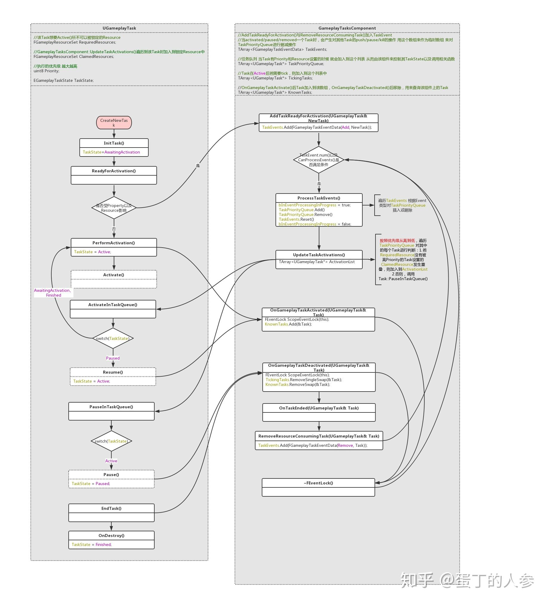

### GameplayTask 与 GameplayTaskComponent

REF: https://zhuanlan.zhihu.com/p/76925045

GameplayTask 是异步任务，GameplayTaskComponent 负责管理多个 GameplayTask 的执行状态，包括：
（1）GameplayTask 执行顺序；
（2）不同 GameplayTask 执行优先级；
（3）GameplayTask 的暂停、恢复；
（4）GameplayTask 之间的资源互斥；

用 C++ 实现 GameplayTask 时，只需要实现三个方法：
* GameplayTask::Activate()
* GameplayTask::Pause()
* GameplayTask::Resume()
用来表示 GameplayTask 在激活、暂停和恢复三种状态下的行为。

GameplayTask 需要自己处理何时结束时机，调用 GameplayTask::EndTask() 表示任务结束。

另一个和 GameplayTask 功能类似的类是： UBlueprintAsyncActionBase，同样的能够进行异步任务执行，但从用例上看，似乎并没有任务调度管理，如果只想实现一个简单的异步任务，不考虑状态管理、互斥等情况，可以直接用 UBlueprintAsyncActionBase 更好。REF: https://neil3d.github.io/unreal/bp-async.html

### AbilityTask 

REF: https://zhuanlan.zhihu.com/p/369200245

AbilityTask 是 GAS 框架中的异步任务类，派生自 GameplayTask，它在 GameplayTask 基础上对技能系统的任务做了特化，技能数据的网络同步复制。用法上与 GameplayTask 一样。