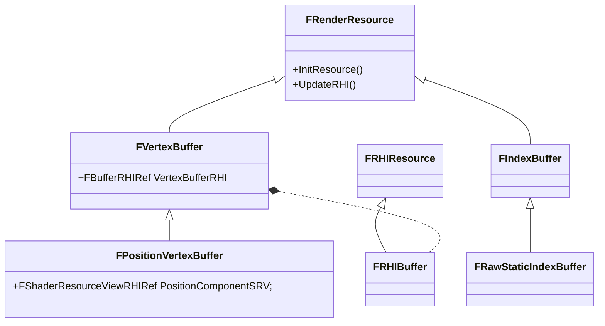

#todolist
- https://www.cnblogs.com/timlly/p/15156626.html

# 不同 Buffer / ShaderResource 设置到 RHICmdList 的不同 API 

#todolist 想清楚为什么 API 会设计的不一致？去看看底层调用源码

FRHIUniformBuffer
RHICmdList.SetShaderUniformBuffer

FRHISamplerState
RHICmdList.SetShaderSampler

FRHITexture
RHICmdList.SetShaderTexture

FRHIShaderResourceView
RHICmdList.SetShaderResourceViewParameter

uint8*
RHICmdList.SetShaderParameter

遇到的许多 FRHI 类：
- 基类：FRHIBuffer, FRHITexture(他们的基类是 FRHIResource)
  - FTexture2DRHIRef, RHICreateTexture2D()
  - RWStructuredBuffer<T>, RHICreateStructuredBuffer()
  - FUnorderedAccessViewRHIRef, RHICreateUnorderedAccessView()

遇到许多 Shader Parameter 相关类：
- FShaderResourceParameter
- FRWShaderParameter
- FShaderParameter

FRHIBuffer/FRHITexture 要设置到 Shader 里，需要经过一系列转化：FRHIBuffer/FRHITexture 及其派生类对象 -> 经过 RHICreateUnorderedAccessView()/RHICreateShaderResourceView() 创建出 -> FRHIUnorderedAccessView/FRHIShaderResourceView -> 设置到 FShaderResourceParameter/FRWShaderParameter

# VertexBuffer 类型
- FVertexInputStream 的 FRHIBuffer* 类型 
- FVertexElement、FVertexStreamComponent 的 FVertexBuffer

# FRenderResource 操作 

- InitRHI()
- BeginInitResource() : 推送到渲染线程执行
- ReleaseResource() : 释放资源