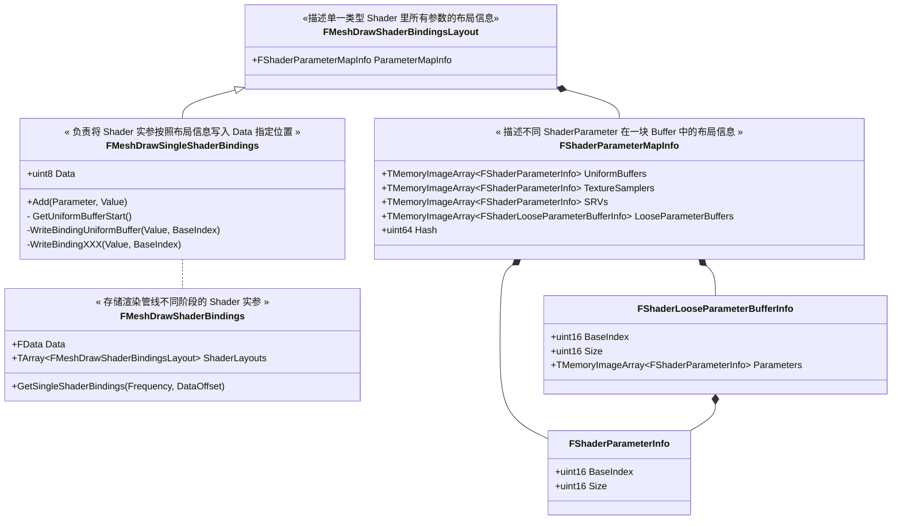
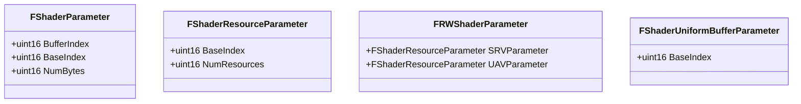
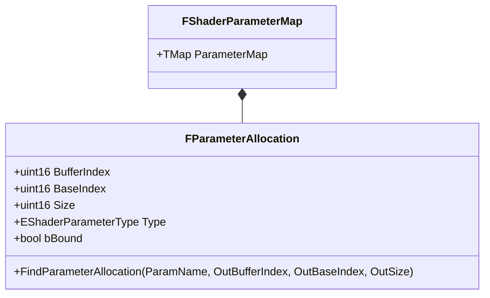

UE 在创建 MeshDrawCommand 时，会提前设置好每个 MeshDrawCommand 里的 ShaderBinding 对象。ShaderBinding 保存了 Shader HLSL 运行前需要传入的参数。前几个案例里面，每个 Shader 类设置参数的方式都是类似的，如下：
```c++
void SetParameters(FRHICommandListImmediate& RHICmdList, const FLinearColor &MyColor, FTextureRHIRef &MyTexture) {
   SetShaderValue(RHICmdList, ShaderRHI, ColorVal, MyColor);
   SetTextureParameter(RHICmdList, ShaderRHI, TextureVal, TextureSamplerVal, TStaticSamplerState<SF_Trilinear, AM_Clamp, AM_Clamp, AM_Clamp>::GetRHI(), MyTexture);
}
```
这是在真正执行绘制前，给 Shader 设置好所有必须参数。

在 UE 新渲染管线中，创建 MeshDrawCommand 时用 ShaderBinding 对象收集了 Shader 所有需要的参数，但此时 MeshDrawCommand 刚刚创建，距离被执行需要一段时间，不可立即设置 Shader 参数。所以 ShaderBinding 的作用只是用来收集 Shader 未来需要设置的参数。待到 MeshDrawCommand 真正被提交到 RHICmdList 之前，再从 ShaderBinding 中把参数取出来赋值，收集代码如下：

```c++
if (PassShaders.VertexShader.IsValid())
{
	FMeshDrawSingleShaderBindings ShaderBindings = SharedMeshDrawCommand.ShaderBindings.GetSingleShaderBindings(SF_Vertex, DataOffset);
	PassShaders.VertexShader->GetShaderBindings(Scene, FeatureLevel, PrimitiveSceneProxy, MaterialRenderProxy, MaterialResource, DrawRenderState, ShaderElementData, ShaderBindings);
}

if (PassShaders.PixelShader.IsValid())
{
	FMeshDrawSingleShaderBindings ShaderBindings = SharedMeshDrawCommand.ShaderBindings.GetSingleShaderBindings(SF_Pixel, DataOffset);
	PassShaders.PixelShader->GetShaderBindings(Scene, FeatureLevel, PrimitiveSceneProxy, MaterialRenderProxy, MaterialResource, DrawRenderState, ShaderElementData, ShaderBindings);
}

```
# ShaderBinding 的实质

ShaderBinding 字面意思是把 Shader HLSL 中的变量和一块 Buffer 做绑定

UE ShaderBinding 的实质是：将 Shader HLSL 中的参数的索引保存在 C++ 侧的某一块内存区域；将准备给 Shader HLSL 中参数赋值的 Buffer 指针，保存在 C++ 侧的另一块内存区域；通过以上两块内存区域的关系，可以知道参数索引和 Buffer 之间的对应关系。

- ** Shader 参数索引保存在 C++ 侧某一块内存区域 **

具体到代码中：FMeshDrawShaderBindingsLayout 负责管理 Shader 参数布局信息，布局里保存了参数索引(BaseIndex)。

- ** 给 Shader 参数赋值的 buffer 指针保存在 C++ 侧的另一块内存区域 **

具体到代码中：FMeshDrawShaderBindings 管理一块内存，用于存储 Shader 参数 buffer 指针，且这块内存中的数据按照 FMeshDrawShaderBindingsLayout 中的布局信息来排布。

因此通过 FMeshDrawShaderBindingsLayout 和 FMeshDrawShaderBindings 两个配合工作，就能够知道将哪一块内存 buffer 和 Shader 参数索引(BaseIndex) 进行绑定。

# ShaderBindings 工作原理

ShaderBindings 的目标是在 MeshDrawCommand 最终执行之前，把 Shader 参数的 buffer 指针和 BaseIndex 绑定起来，要解决两个问题：
1. 要绑定哪些 buffer 指针；
2. buffer 指针绑定到哪个 BaseIndex

#todolist 改成文字形式

## Shader 参数的布局

*所谓布局，指某一类型的数据在一块内存 buffer 中从起始位置开始的偏移和占用内存的大小。有了布局信息，就能在无结构 Buffer 中寻址任意 Shader 类型参数的位置*



*Q1: Shader 参数布局信息*
> FMeshDrawShaderBindings 负责计算 Shader 参数的布局。
> 
> 一个 Shader 可能有多种不同类型的参数，包括：UnifromBuffer、TextureSampler、SRVs 等，且不同类型参数的数量也有多个。FShaderParameterInfo 用多个数组把这些参数的索引(BaseIndex)、大小(Size) 记录下来，FMeshDrawShaderBindingsLayout 用这些信息来计算 Shader 参数的布局

*Q2：Shader 实际参数的填充*
> FMeshDrawSingleShaderBindings 负责实际参数的填充
>
> FMeshDrawSingleShaderBindings 继承自 FMeshDrawShaderBindingsLayout，所以内部有 Shader 参数的布局信息。这样就能够用 BaseIndex 寻址，把参数保存起来。
>
> 运行中 FMeshDrawSingleShaderBindings 是由 FMeshDrawShaderBindings 创建的。FMeshDrawShaderBindings 从内部的 FData 中取出一块内存数据给 FMeshDrawSingleShaderBindings 来存储 Shader 实际参数。

实际参数流程如下：

流程：
1. 判断当前 Shader 类型(VetextShader, PixelShader, etc)，确定要写入到哪一块内存数据(FMeshDrawShaderBindings 负责分配 FData 内存数据)
2. 开始填充 Shader 实参数据。拿到参数索引(BaseIndex)，依据索引计算参数填充位置(FMeshDrawSingleShaderBindings 负责填充)
   1. Shader HLSL 编译过程中搜集 Shader 变量名、Shader 变量索引，按照变量名到索引的映射形式存入 FShaderParameterMap(参考[[reading-notes.graphics-engineering.unreal-engine.renderpipeline-and-framework-design.shader-bindings#shader-hlsl-变量索引保存位置]])
   2. 每个 Shader 创建时尝试用 Shader 变量名搜索 FShaderParameterMap 里的 Shader HLSL 变量索引(BaseIndex)，然后把变量索引设置到自己的 FShaderXXXParameter 里面。
   #todolist 展示代码
   3. FShaderParameterInfo 的布局存有参数索引信息，因此可以通过参数索引逆搜索参数填充位置(二分搜索) #todolist 详细说明具体搜索过程

回到最开始的问题：
1. 要绑定哪些 buffer 指针
    > buffer 指针已存储到 FMeshDrawShaderBindings 的 FData 变量中，按照 FMeshDrawShaderBindingsLayout 存储的布局信息来索引 FData 变量

2. buffer 指针绑定到哪个 BaseIndex
    > FMeshDrawShaderBindingsLayout 保存了 BaseIndex 信息，在 FData 上遍历时查找 FMeshDrawShaderBindingsLayout 就能搜索到 BaseIndex。


# 变量索引 (BaseIndex) 的获取
## Shader 初始化时从 ParameterMap 中收集 HLSL 变量索引(BaseIndex)
#todolist 给出 Shader 初始化时 Bind() 代码



## ParameterMap 与 HLSL 变量索引(BaseIndex)
### Shader HLSL 变量索引(BaseIndexx)保存位置


总结：Shader 参数的索引是通过 UE 的反射系统计算出来，并存储在 FShaderParameterMap。每个 Shader 初始化时会调用 Bind 函数把 FShaderParameterMap 里的索引取出来，存到自己的 FShaderXXXParameter 里面。这样就完成了 Shader 形参的绑定。

### Shader HLSL 变量索引(BaseIndex)收集过程
#todolist

# 给 Shader HLSL 变量赋值
## 收集 C++ Shader 参数
#todolist

参考：FMeshPassProcessor::BuildMeshDrawCommands(
    const ShaderElementDataType& ShaderElementData
)

## 将 C++ Shader 参数设置到 HLSL 变量索引位置(BaseIndex)

参考： FMeshDrawShaderBindings::SetShaderBindings()

SRV 和 Texture 资源混合在一起存储在 SingleShaderBindings.GetSRVStart() 这个位置，但在设置 Shader 参数时要判断到底是 SRV 类型还是 Texture 类型，UE 的做法是在 SRVs 数据块后面跟着一个数据块，用 bit 位来表示到底是 SRV 还是 Texture。

FShaderBindingState& RESTRICT ShaderBindingState UniformBuffer 数据缓存机制

实际设置行为：
RHICmdList.SetShaderUniformBuffer(Shader, BaseIndex, UniformBuffer)

#todolist
- TMemoryImageArray
- FShaderParameterInfo
- FShaderLooseParameterBufferInfo