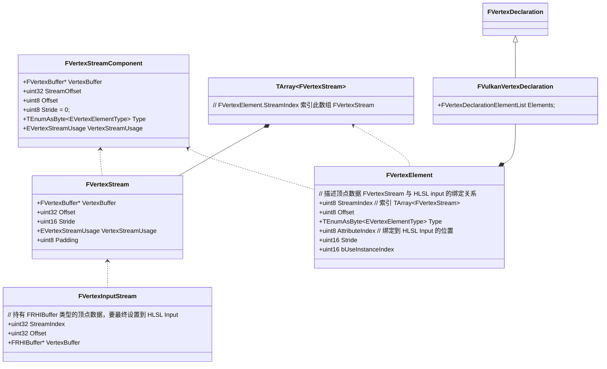

作用：
- 绑定 Shader 
- 绑定顶点数据 VertexBuffer 
- 绑定输入数据布局 Input Layout
- 其他需要绑定数据

前文配置顶点数据已知的操作：
- 创建 FVertexDeclarationRHI
- FVertexDeclarationRHI 设置到 graphics pipeline 

#todolist 复习 FVertexDeclaration 具体写法

# Step 1: FVertexFactory 创建 VertexDeclaration

## 顶点数据存储位置 FVertexStreamComponent
- FVertexStreamComponent: 封装顶点数据：VertexBuffer, StreamOffset, Offset, Stride 
- FStaticMeshDataType: 封装不同类型的顶点数据(Position, Color, TangentBasis)，用 FVertexStreamComponent 封装.

> FVertexFactory 持有 FStaticMeshDataType 及其子类变量，用于存储顶点数据。如果是自定义 FVertexFactory 类型，甚至可以不用 UE 定义的 FStaticMeshDataType，只要自己定义一些 FVertexStreamComponent、FRHIShaderResourceView 就行了。

## 顶点布局描述 FVertexDeclaration
- FVertexElement: 描述 FVertexStreamComponent 和着色器的哪个 VertexBuffer 输入对应起来(StreamIndex, AttributeIndex)；然后据此创建 FRHIVertexDecleration
- FRHIVertexDecleration: 描述顶点数据输入布局 input layout：VertexBuffer 对应着色器的第几个输入、VertexBuffer 内部数据类型、Offset、Stride 

> FVertexFactory::InitDeclaration()，输入 FVertexElement 数组，创建 FRHIVertexDecleration

## Conclusion 
- FVertexFactory 存储了顶点数据布局描述、顶点数据与 Shader 输入顶点数据的对应关系(Vertex Data 与 Shader Input Attribute 的连接关系)
- FVertexFactory 负责管理 HLSL 输入数据的布局描述、HLSL 输入顶点数据与 VertexBuffer 对应关系。具体来说就是负责创建 FRHIVertexDecleration
  - FVertexStreamComponent: 描述顶点数据布局
  - FVertexElement: 描述顶点数据与 HLSL 输入的对应关系
  - FRHIVertexDecleration: 由 FVertexStreamComponent + FVertexElement 创建，最终提供给 graphics pipeline 负责描述顶点数据布局
- FVertexFactory 负责控制 UberShader 中的宏，定制需要的 Shader 
- FVertexFactory 的实现相关宏: 
  - DECLARE_TYPE_LAYOUT, 
  - IMPLEMENT_TYPE_LAYOUT, 
  - IMPLEMENT_VERTEX_FACTORY_PARAMETER_TYPE

#todolist FRHIVertexDecleration 会被缓存起来，被 VertexFactory 复用，这是什么意思？参考 FVertexFactory::InitDeclaration()

参考： [[VertexFactory 相关类概述 | proxy.unrealengine.renderpipeline#vertexfactory-class-overview]]

# Step 2: FVertexFactory 与 HLSL Input 的绑定

相关类：
- FVertexStream: 和 FVertexStreamComponent 结构很类似，不知道有什么作用 #todolist FVertexStream 和 FVertexStreamComponent 区别
- FPrimitiveSceneProxy 持有 UMaterialInterface 和 FXXXVertexFactory，负责材质、顶点数据描述

## 利用 C++ Macro 绑定 HLSL 代码
- IMPLEMENT_MATERIAL_SHADER_TYPE 绑定的是 C++ Shader 和 HLSL 中的参数
- IMPLEMENT_VERTEX_FACTORY_TYPE 绑定的是 C++ VertexFactory 和 HLSL 中的顶点数据

** 所谓的 HLSL 绑定，就是 FVertexFactory 生成一份包含顶点数据说明的 *.ush 文件。**

#todolist DECLARE_VERTEX_FACTORY_TYPE(FLocalVertexFactory) 具体如何实现?

无论是 Shader 还是 VertexFactory，和 HLSL 做绑定时，都会用宏来控制 UberShader 开关，定制自己的 Shader。

## FRHIResource & FRenderResource & SRV & UAV

#todolist 理解 FRenderResource & FRHIResource
FRenderResource 负责创建释放 FRHIResource

## Conclusion
- FVertexFactory 用 C++ Macro 与 HLSL 绑定在一起，并定制自己的 HLSL 代码
- FPrimitiveSceneProxy 负责创建 FVertexFactory

参考：https://zhuanlan.zhihu.com/p/128656015

# Step 3: 顶点输入数据绑定到 Pipeline (TODO)
https://zhuanlan.zhihu.com/p/361322348

[[自定义 MeshComponent Part 1 | proxy.unrealengine.renderpipeline#creating-a-custom-mesh-component-in-ue4-part-1]]

## 把顶点数据类型由 FVertexBuffer 转化为 FRHIBuffer
- FVertexStream : 与 FVertexStreamComponent 基本一致，不清楚具体作用
- FVertexInputStream : 也持有顶点数据，StreamIndex，Offset，看起来与 FVertexStreamComponent 没有什么不同。对比 FVertexElement 发现顶点数据的类型不一样。
  - FVertexInputStream 持有 FRHIBuffer* 类型顶点数据
  - FVertexElement、FVertexStreamComponent 持有 FVertexBuffer* 类型顶点数据

  这说明 FVertexBuffer 类型的顶点数据需要转化为 FRHIBuffer 类型才能设置到 GPU 中。

把顶点数据从 FVertexBuffer 转化为 FRHIBuffer 的过程实际上是从渲染侧资源(FRenderResource)创建 RHI 资源(FRHIResource)的过程。这一过程发生在 MeshDrawCommand 创建的地方，从顶点工厂(VertexFactory)拿到 VertexStream.VertexBuffer，得到 VertexBuffer 的 RHI 引用并保存到 MeshDrawCommand。

```c++
void FMeshPassProcessor::BuildMeshDrawCommands() 
{
    // 从 MeshBatch 中拿到 VertexFactory
    const FVertexFactory* RESTRICT VertexFactory = MeshBatch.VertexFactory;
    // 创建 PSO 
    FGraphicsMinimalPipelineStateInitializer PipelineState;

    // 拿到 VertexFactory 里的顶点数据布局描述，保存到 PSO
    FRHIVertexDecleration* VertexDeclaration = VertexFactory->GetDeclaration(InputStreamType);
    PipelineState.SetupBoundShaderState(VertexDeclaration, MeshProcessorShaders);

    // Other code ...

    // 从 VertexFactory 中拿到 FVertexBuffer，获取 RHI 引用设置到 SharedMeshDrawCommand 里面。
    VertexFactory->GetStream(FeatureLevel, InputStreamType, SharedMeshDrawCommand.VertexStreams);

    // Other code ...

    // 保存 PSO 到 MeshDrawCommand
    DrawListContext->FinalizeCommand(XXX, PipelineState, &ShadersForDebugging, MeshDrawCommand);
}
```

## FVertexBuffer 设置到 RHICmdList 

上文构建 MeshDrawCommand 过程中把 FVertexFactory 中的顶点数据 FVertexStream 保存到了 MeshDrawCommand.VertexStreams 变量。而我们已经知道 MeshDrawCommand 相当于把绘制指令的 ShaderBinding、VertexBuffer 提前保存了起来，等到要绘制的时候再把数据填充到 RHICmdList 里面。我们看下面这段代码，就知道 FVertexFactory 里的 VertexStream 是如何设置到 RHICmdList 里面的了。

```c++
bool FMeshDrawCommand::SubmitDrawBegin() 
{
    // 获取 MeshDrawCommand 里保存的 PSO 
    const FGraphicsMinimalPipelineStateInitializer& MeshPipelineState = MeshDrawCommand.CachedPipelineId.GetPipelineState(GraphicsMinimalPipelineStateSet);

    if (MeshDrawCommand.CachedPipelineId.GetId() != StateCache.PipelineId) 
    {
        // 如果当前 RHICmdList 缓存的 PSO 与即将 DrawCall 的 PSO 不一致，则重新设置 RHICmdList 的 PSO
        FGraphicsPipelineStateInitializer GraphicsPSOInit = MeshPipelineState.AsGraphicsPipelineStateInitializer();
        RHICmdList.ApplyCachedRenderTargets(GraphicsPSOInit );

        // Other code ...

        SetGraphicsPipelineState(RHICmdList, GraphicsPSOInit, MeshDrawCommand.StencilRef, EApplyRendertargetOption::CheckApply, bApplyAdditionalState, PSOPrecacheResult);
    }

    for (int32 VertexBindingIndex = 0; VertexBindingIndex < MeshDrawCommand.VertexStreams.Num(); VertexBindingIndex ++) 
    {
        const FVertexInputStream& Stream = MeshDrawCommand.VertexStreams[VertexBindingIndex];
        // other code

        // 把保存的顶点数据设置到 HLSL Input
        RHICmdList.SetStreamSource(Stream.StreamIndex, Stream.VertexBuffer, Stream.Offset);

        // 保存的 HLSL 变量绑定到 RHICmdList
        MeshDrawCommand.ShaderBindings.SetOnCommandList(RHICmdList, MeshPipelineState.BoundShaderState.AsBoundShaderState(), StateCache.ShaderBindings);
    }
}
```

## ush 与 usf 的区别
FVertexFactory 与 HLSL template 绑定后会定制 HLSL 代码，但这个 HLSL 并不真正包含执行代码，而只有一些函数和结构体。其他不同 Pass 的 Shader 会包含(include)生成的 HLSL 文件。所以 FVertexFactory 定制的 HLSL 代码以 *.ush 结尾而不是 *.usf。

## 获取 FVertexFactory 与 Shader HLSL Input 的映射关系

#todolist 讲清楚是什么映射关系

- DECLARE_VERTEX_FACTORY_TYPE 
  用 C++ Macro 对 FVertexFactory 实现反射。这两个 C++ Macro 实现了对 FVertexFactory 的反射，把 FVertexFactory 的成员变量、成员函数指针存放到了 FVertexFactory::StaticType 变量。

- IMPLEMENT_VERTEX_FACTORY_TYPE
  实现 FVertexFactory，生成 Shader 变体 HLSL 代码。

#todolist 

- VertexBuffer 排布 https://anteru.net/blog/2016/storing-vertex-data-to-interleave-or-not-to-interleave/

- ShaderPermutations https://medium.com/@lordned/unreal-engine-4-rendering-part-5-shader-permutations-2b975e503dd4

- Global Uniform Shader https://medium.com/@solaslin/learning-unreal-engine-4-adding-a-global-shader-uniform-1-b6d5500a5161

- Shader Debug Workflow https://docs.unrealengine.com/5.2/en-US/shader-debugging-workflows-unreal-engine/

- Shader Permutation 是如何运作的？

----
# Step 4: FVertexFactory 与 HLSL 变量的绑定


----
# Step 5: FVertexFactory 的实现 

FVertexFactory 负责两方面的事情：
1. 创建顶点数据布局描述(FVertexDeclaration)，设置到 Pipeline
2. 创建顶点数据流(FVertexInputStream)，设置到绘制调用入口
3. 与 HLSL 绑定，自定义 UberShader 
4. 初始化顶点数据，顶点数据由物件渲染代理提供(FPrimitiveSceneProxy)

参考：
- https://medium.com/realities-io/creating-a-custom-mesh-component-in-ue4-part-2-implementing-the-vertex-factory-4e21e51a1e10

- https://zhuanlan.zhihu.com/p/361037729

- 代码: https://github.com/AyoubKhammassi/CustomMeshComponent

----
# FVertexFactory 位于渲染框架的哪个地方

三个问题
- FVertexFactory 从什么地方接收顶点数据的
- FVertexFactory 如何描述顶点数据的布局
- FVertexFactory 如何向外部接口提供顶点数据




## 描述顶点数据布局