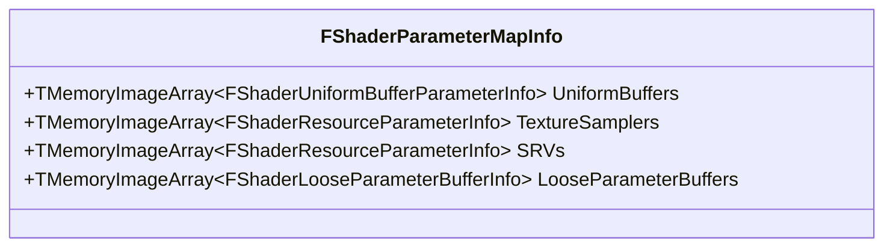
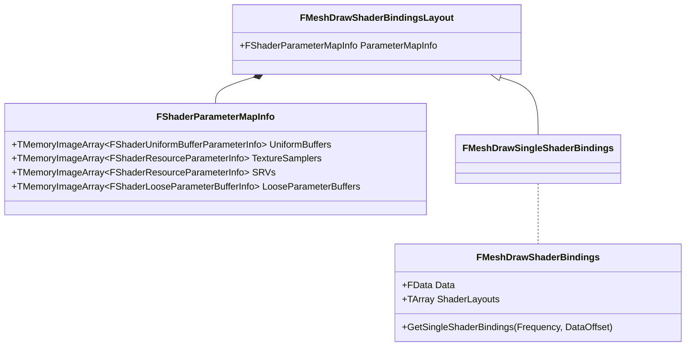

UE 在创建 MeshDrawCommand 时，会提前设置好每个 MeshDrawCommand 里的 ShaderBinding 对象。ShaderBinding 保存了 Shader 代码运行前需要传入的参数。前几个案例里面，每个 Shader 类设置参数的方式都是类似的，如下：
```
void SetParameters(FRHICommandListImmediate& RHICmdList, const FLinearColor &MyColor, FTextureRHIRef &MyTexture) {
   SetShaderValue(RHICmdList, ShaderRHI, ColorVal, MyColor);
   SetTextureParameter(RHICmdList, ShaderRHI, TextureVal, TextureSamplerVal, TStaticSamplerState<SF_Trilinear, AM_Clamp, AM_Clamp, AM_Clamp>::GetRHI(), MyTexture);
}
```
这是在真正执行绘制前，给 Shader 设置好所有必须参数。

在 UE 新渲染管线中，创建 MeshDrawCommand 时用 ShaderBinding 对象收集了 Shader 所有需要的参数，但此时 MeshDrawCommand 刚刚创建，距离被执行需要一段时间，不可立即设置 Shader 参数。所以 ShaderBinding 的作用只是用来收集 Shader 未来需要设置的参数。待到 MeshDrawCommand 真正被提交到 RHICmdList 之前，再从 ShaderBinding 中把参数取出来赋值。

## Shader 参数相关类

问题：Shader 参数存储在哪儿？


**Shader 参数的存储位置**

FShaderParameterMapInfo 用数组保存 Uniform、Texture、SRV、LooseParameterBuffer



**Shader 参数的布局描述**

*所谓布局，指某一类型的数据在一块内存 buffer 中从起始位置开始的偏移和占用内存的大小。*

问题：存储 Shader 参数的 buffer 是无结构数据，所以才需要指定布局。那么为什么要用无结构 buffer 来保存 Shader 参数？

FMeshDrawShaderBindingsLayout 持有 FShaderParameterMapInfo 成员变量，由于 FShaderParameterMapInfo 保存有 Shader 参数信息，可以方便的计算这些 Shader 参数的大小，在一块 Buffer 上做寻址偏移，得到 Shader Parameter Layout 布局

**FMeshDrawShaderBindings**

持有一个 Buffer 数组，数组大小和 MeshDrawCommand 要使用的 Shader 数量一致。Buffer 里保存的内容是 MeshDrawCommand 要用到的 Uniform 引用，包括 SRV 等。

- 属性 Data: 存储 binding 信息
- 属性 ShaderLayouts(FMeshDrawShaderBindingsLayout :array): 描述 binding 布局

**FMeshDrawSingleShaderBindings(extends FMeshDrawShaderBindingsLayout)**
1. 保存单个 Shader 资源的绑定信息(ShaderLayout)和Shader资源本身(Data)，两者都由 FMeshDrawShaderBindings::GetSingleShaderBindings() 内创建

**FMeshDrawShaderBindingsLayout**
1. 保存单个Shader内每种类型资源的数量，不同不同类型资源的数量由 Shader 反射机制计算出来
2. FShaderParameterMapInfo，保存布局信息。用到 DECLARE_TYPE_LAYOUT、LAYOUT_FIELD 两种宏定义布局(不同类型的数量)，参考：[[阅读笔记.UnrealEngine.渲染流程与数据组织框架.LAYOUT_FIELD]]

   1. DECLARE_TYPE_LAYOUT
   2. LAYOUT_FIELD
   3. TMemoryImageArray
   4. FShaderParameterInfo
   5. FShaderLooseParameterBufferInfo

