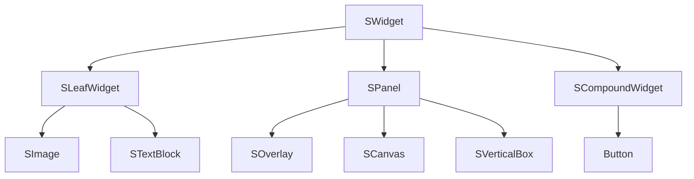

[[虚幻4渲染编程（UI篇）【第一卷：Slate框架综述】|proxy.unrealengine.slate-framework#slate-overview]]

[[虚幻5渲染编程 (UI篇)【第一卷: Slate渲染框架并通过为 UMG 拓展 MeshUI 了解 Slate 的图元阶段】|proxy.unrealengine.slate-framework#定制-ui-效果]]


# Widget 分类
所有的 Widget 都继承一个基类 SWidget，这些 Widget 通过继承方式又可以分为三大类，不同类的 Widget 可引用的子 Widget 数量、负责的功能各不相同
- SPanel：可引用多个子 Widget；负责子 Widget 的布局；
- SCompoundWidget：只引用一个子 Widget；通常负责对子 Widget 的一些封装、修改；
- SLeafWidget：不引用子 Widget；负责实现特定 UI 功能；



## Slate 绘制流程概览

UI 上各个 Widget 是通过树型结构组织的，Parent Widget 对 Children Widget 的引用构成了树。正式执行渲染前，UI 数据的收集流程就在树上进行深度优先递归来实现

1. GameThread 处理
- Prepass: 从下到上遍历 UI 树，计算 Widget 大小
- OnPaint: 从上到下遍历 UI 树，每个 Widget 的 OnPaint 函数负责收集 UI 组件数据(FSlateDrawElement)，收集完毕后提取顶点数据。(有文章说此阶段进行了合批，但有的文章说合批在 RenderThread 进行的) 
- Render: 渲染每个 DrawElement，同时尝试合批，最后把合批结果提交 RHICommand 绘制。

2. RenderThread 处理
- 对 UI 元素排序，按照 LayerId 和 IsBatchableWith() 返回值进行合批，所有 UI 的顶点数据合并成一个大 Buffer，提交到 RHICommandList(参考：FSlateRHIRenderingPolicy::BuildRenderingBuffers())
- 遍历合批后的 RenderBatch，一个 Batch 对应一个 DrawCall

## UI 元素抽象结构

- FDrawWindowArgs
  - FSlateDrawBuffer: 保存 UI 元素列表
    - TArray<TSharedRef<FSlateWindowElementList>> WindowElementLists: SlateWindow 列表存储位置

- FSlateDrawElement: Slate 将所有可见的 UI 抽象成 FSlateDrawElement 的列表。FSlateDrawElement 保存绘制的 Position、绘制的元素类型。每个 SlateWindow 保存各自的 UI Element 列表，而 FSlateDrawElement 作为 FSlateWindowElementList 的元素列表而存在。

- FSlateElementBatcher：收集 UI Element 的顶点 Buffer，FSlateElementBatcher::AddElementsInternal() 判断添加的 UI Elements 类型。执行打包收集顶点数据操作

- FSlateBatchData：FSlateElementBatcher 添加的 顶点数据被填充到 FSlateBatchData 的 RenderBatches(FSlateRenderBatch) 变量。而 FSlateElementBatcher::BatchData 又是对 FSlateWindowElementList::BatchData 的引用，所以最后收集到的顶点数据都被填充到 FSlateWindowElementList 里。

调用入口从何处看起：
- 收集每个 Window 里的 UI 元素，以及顶点数据：
  - PrivateDrawWindow -> DrawWindowAndChildren() 收集每个 Window 里面的 UI Element，保存类型
  - Renderer->DrawWindows(FSlateDrawBuffer) 收集每个 UI Element 的顶点、索引数据

#### 顶点数据收集过程调用堆栈

逻辑侧，UI 以树为组织单位，依靠 SWidget::Paint() & SWidget::OnPaint() 做深度递归。第一级递归开始传入 FDrawWindowArgs，后续递归过程将收集 UI 元素填充进 FDrawWindowArgs::FSlateDrawBuffer::WindowElementList 里面。

FEngineLoop::Tick() -> FSlateApplication::Tick() ->FSlateApplication::TickAndDrawWidgets()
- DrawWindows() -> PrivateDrawWindow()
  - DrawWindowAndChildren() 最先从 FSlateApplication 开始调用，遍历位于最顶端的窗口元素 SlateWindows 变量
    (经过多次 SWidget::Paint() 和 SXXX::OnPaint() 之后，最后位于 UI 树木根节点的 SXXX::OnPaint())
    - SImage::OnPaint() (叶节点以 SImage 为例) -> FSlateDrawElement::MakeBox()
      - 判断该 UI 是否需要裁剪(调用 ShouldCull())，比如全透明的 UI 需要裁掉。
- DrawWindows() -> Renderer::DrawWindows(OutDrawBuffer) -> FSlateRHIRenderer::DrawWindows_Private(OutDrawBuffer)
  - FSlateElementBatcher::AddElements() -> FSlateElementBatcher::AddElementsInternal() 上文收集到的 Window 里的 UI 组件逐个遍历，判断其类型(ET_Box、ET_RoundedBox 等) 来添加顶点数据。
    - AddXXXElement() 判断 UI 类型后调用不同的 AddXXXElement() 函数，例如 AddBoxElement()、AddTextElement()
      - CreateRenderBatch() 创建一个 RenderBatch (UI 批处理对象)，里面有 UI 的顶点数据。
      - 用 Vertex/Index 数据填充上面的 RenderBatch。提一下 Text 是如何处理的，他是直接填充了两个三角形绘制，文字用材质来表示，参考：ElementBatcher.cpp line 1126
  - 每遍历到一个 Window，就触发 DrawWindow_RenderThread()，把 UI Element 提交到渲染线程绘制。

## Slate 渲染器

继承结构：
FSlateRenderer
- FSlateRHIRenderer
- FSlateOpenGLRenderer

最终调用位置是：DrawWindows_Private() -> DrawWindow_RenderThread()
STAT_SlateRenderingRTTime

### Text 的渲染

#todolist 
论述形式优化：(1) 用文字介绍流程；(2) 代码只做文字的补缀

文本渲染用了一张大纹理图 TextureAtlas 集中存储字符。此 TextureAtlas 在程序运行过程种动态收集字符

- 字符顶点数据、纹理数据提取
```

    for( uint32 CharIndex = 0; CharIndex < NumChars; ++CharIndex ) {
        // 提取字符缓存的纹理数据(纹理坐标，引用哪张 TextureAtlas)
        const FCharacterEntry& Entry = CharacterList.GetCharacter(CurrentChar, DrawElementPayload.GetFontInfo().FontFallback);

        // 计算 UV 
        const float U = Entry.StartU * InvTextureSizeX;
		const float V = Entry.StartV * InvTextureSizeY;

        // 填充 RenderBatch 顶点数据
        RenderBatch->AddVertex(FSlateVertex::Make<Rounding>( RenderTransform, FVector2f(UpperLeft),					FVector4f(U,V,Ut,Vt),						FVector2f(0.0f,0.0f), FontTint ));
		RenderBatch->AddVertex(FSlateVertex::Make<Rounding>( RenderTransform, FVector2f(LowerRight.X,UpperLeft.Y),	FVector4f(U+SizeU, V, UtMax,Vt),			FVector2f(1.0f,0.0f), FontTint ));
		RenderBatch->AddVertex(FSlateVertex::Make<Rounding>( RenderTransform, FVector2f(UpperLeft.X,LowerRight.Y),	FVector4f(U, V+SizeV, Ut,VtMax),			FVector2f(0.0f,1.0f), FontTint ));
		RenderBatch->AddVertex(FSlateVertex::Make<Rounding>( RenderTransform, FVector2f(LowerRight),				FVector4f(U+SizeU, V+SizeV, UtMax,VtMax),	FVector2f(1.0f,1.0f), FontTint ));

        ... ...
    }

```

- 字符数据在 TextureAtlas 上的缓存

```
    if (bDirectIndexChar)
	{
		if (DirectIndexEntries.IsValidIndex(Character))
		{
            // 从 DirectIndexEntries 获取字符纹理缓存数据
			InternalEntry = &DirectIndexEntries[Character];
		}
	}
	else
	{
        // 从 MappedEntries 获取字符纹理缓存数据
		const FCharacterListEntry* const FoundEntry = MappedEntries.Find(Character);
		if (FoundEntry)
		{
			InternalEntry = FoundEntry;
		}
	}

```

- 字符数据的读取
```
    // 字符像素数据读取，采用了 FreeType 库
    FT_Outline_Render(Library, Outline, &RasterParams)
```

- TextureAtlas 的创建

```
    // 取出缓存的 TextureAtlas
    TArray<uint8>& FontAtlasIndices = InRenderData.bIsGrayscale ? GrayscaleFontAtlasIndices : ColorFontAtlasIndices;

    // 首先尝试把字符填充进 TextureAtlas
    const FAtlasedTextureSlot* NewSlot = FontAtlas.AddCharacter(InRenderData);
	if( NewSlot )
	{
		OutTextureIndex = FontAtlasIndex;
		FillOutputParamsFromAtlasedTextureSlot(*NewSlot);
		return true;
	}

    // 如果添加失败(即 NewSlot == nullptr)，创建新 TextureAtlas
    TSharedRef<FSlateFontAtlas> FontAtlas = FontAtlasFactory->CreateFontAtlas(InRenderData.bIsGrayscale);

```

- 把字符添加进 TextureAtlas 
``` 
    const FAtlasedTextureSlot* FSlateFontAtlas::AddCharacter( const FCharacterRenderData& RenderData )
    {
	    check(RenderData.bIsGrayscale == IsGrayscale());
	    return AddTexture( RenderData.SizeX, RenderData.SizeY, RenderData.RawPixels );
    }

    // @param TextureWidth, TextureHeight 字符纹理大小
    FAtlasedTextureSlot\* FSlateTextureAtlas::AddTexture(uint32 TextureWidth, uint32 TextureHeight, const TArray<uint8>& Data) 
    {
        // 在 TextureAtlas 种查找空闲位置，把字符放进去
        const FAtlasedTextureSlot* NewSlot = FindSlotForTexture(TextureWidth, TextureHeight);
        // ... ... 
        // 字符像素写入 TextureAtlas
        CopyDataIntoSlot(NewSlot, Data)
    }
```

# Slate 相关统计指令与优化

## Slate 性能统计指令
stat Slate
Num Painted Widgets: 执行 OnPaint 的数量
Num Batches: Draw Call

## 优化方案

#unrealengine.optimize

### Game Thread 优化
- Invalidation Box 优化：缓存渲染信息，子组件更新时重新调用 Paint
  - Volatile: 变量，标记某个子 Widget 是可变的，单独 update 
  - ComputeVolatility: 影响 Widget 变动的属性。
- Visibility 优化：是否可见、是否可点击、是否占用布局空间。取消一个 Widget 时用 Collapsed\SelfHitTestInvisible 能取得更好的性能(不用重新销毁)
- Widget Binding 每帧执行，性能较低；
  - Tick 中复杂的运行逻辑移动到 C++

### Render Thread 优化

- 怎么合批的？
1. “合批” 是什么意思: FSlateRHIRenderer::BuildRenderingBuffers()。从代码中看出 Slate 合批不是 Instance 合批，而是 VertexBuffer 和 IndexBuffer 合批，即把所有 UI 里的 Vertex\Index 数据填充到一个大 Buffer 里(参考: FinalVertexData、FinalIndexData).
2. 合批流程
   1. 把 WindowElementList.BatchData 里的批数据(RenderBatch)的索引 Index 和 LayerId 存放到数组，按照 LayerId 从小到大做稳定性排序，结果存放到 BatchIndices。参考：FSlateBatchData::MergeRenderBatches()
   2. 把每个 RenderBatch 的 VertexBuffer、IndexBuffer 填充到 FinalVertexData、FinalIndexData(位于 FSlateBatchData)。
   3. 尝试合并当前批数据 CurBatch。依次遍历 BatchIndices (排好序的数组 )，判断其他批数据 OtherBatch 和当前 RenderBatch 是否可合并(参考: IsBatchableWith() 函数)，如果可合并则把 OtherBatch 的顶点数据附加到 FinalVertexData、FinalIndexData 末尾；是否可合并包括两个判断：(1) LayerId 相同；(2) IsBatchableWith() 返回 True。

- 打断合批的因素
1. 组件 LayerId。组件根据 LayerId，从小到大排序，LayerId 不同不能合批。
2. IsBatchableWith() 返回值为 True，否则不能合批次。


**优化工作应该再后期进行**

#### Canvas Plane 合批
Canvas Plane 开启合批，每个子 Widget 如果 ZOrder 相同，则会合并批次。
用法：开启 Explicit Canvas Child ZOrder 属性，位于 Canvas Plane 里的子组件，如果 ZOrder 相同就可以尝试合批。

#### 贴图合并
合并贴图，参考 UPaperSprite

#### 缓存渲染结果到 RT
Retainer Box: 缓存 UI 渲染到 RT，只要子控件树没有更新，每次 OnPaint 只提交缓存的 RT，跳过全部子组件的 Paint 流程，适用于占用大量像素率的情况；重复使用的 UserWidget 不要使用 Retainer Box，不然会生产许多 RT