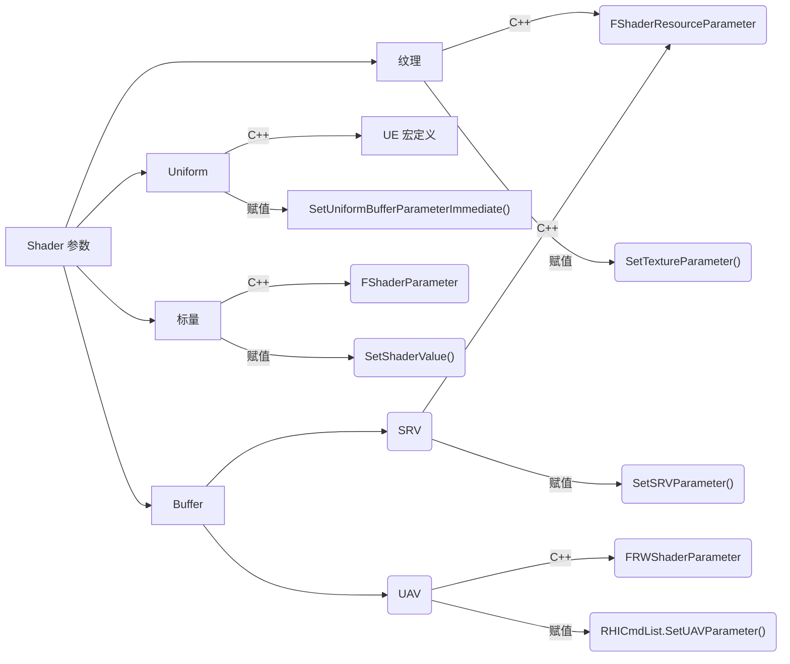

# 案例
- https://zhuanlan.zhihu.com/p/36635394
- https://zhuanlan.zhihu.com/p/36695496

Keywords:
- IMPLEMENT_SHADER_TYPE

**Keypoints**: 
- 自定义 Shader
- 创建 Graphics pipeline

**Process:**
1. 创建 Shader 类继承 GlobalShader，编写 Shader 代码。用宏 IMPLEMENT_SHADER_TYPE 将 Shader 类和 Shader 代码联系起来。
   1. Shader 代码中的 float 变量(SimpleColor)对应到 Shader 类的成员变量(SimpleColorVal)，类型为 FShaderParameter，Shader 类构造函数里用 Initializer.ParameterMap 把两个变量绑定起来；
   2. Shader 类内部调用 SetShaderValue() 给 SimpleColorVal 赋值，相当于更新了 Shader 代码中的 SimpleColor；
2. 设置渲染前准备工作，包括渲染目标(RenderTarget)，设置渲染状态(FGraphicsPipelineStateInitializer，即 Pipeline State Object，简称PSO)，更新 Shader 类参数，准备网格顶点数据。
   1. 获取 RenderTarget，着色器执行结果输出的位置，该案例中结果输出到纹理。
   2. 创建 PSO，这里只关注设置 Shader 的部分。用了 GetGlobalShaderMap() 函数获得定义好的 Shader 类对象，将其赋值给 PSO，这样后续执行渲染时，Shader 代码就能运行起来了。
   3. 更新 Shader 参数。内部调用了 SetShaderValue() 函数更新了 Shader 代码中定义的 SimpleColor 变量的值。
   4. 创建顶点数据。简单创建了一个 float 数组，用于存储顶点数据
3. 执行渲染。案例用了 RHICmdList 类，这里把 RenderTarget，PSO 传给了 RHICmdList，不知道其原理，只知道可以用于后续执行绘制。再把 RHICmdList 和顶点数据传入 DrawIndexedPrimitiveUP()，就可以执行绘制了。

UE 相关解释：
- ENQUEUE_RENDER_COMMAND 宏: [[阅读笔记.graphics-engineering.unreal-engine.renderpipeline-and-framework-design#enqueue_render_command]]
- RHICmdList: [[阅读笔记.graphics-engineering.unreal-engine.renderpipeline-and-framework-design#rhicmdlist]]

总结：
- Shader 代码和 Shader 类的创建
- 渲染管线状态的设置
- 调用 UE 的绘制 API 执行渲染
  
## 案例二
- https://zhuanlan.zhihu.com/p/36696092

**Keywords:**
- 描述顶点数据布局 VertexDecleration
- Shader 的 Buffer 类参数 - FShaderResourceParameter

**Process:**
1. 新增 Shader 代码入口函数参数，需要对应修改 VertexDecleration 和顶点数据
   1. 修改顶点数据。再顶点数组里增加 UV 坐标数据。
   2. FVertexDeclarationRHIRef。顶点数据在传输过程中是无结构的，因此 UE 需要知道顶点数据内部布局(即：偏移多少字节处是 Position 数据？偏移多少字节处是 UV 数据？)，才能把顶点数据和 Shader 代码的入口函数对应起来。具体做法是创建 FVertexDeclarationRHIRef 赋值给 PSO。VertexDecleration 的创建如下：

   ```c++
   FVertexDeclarationElementList Elements;
   uint32 Stride = sizeof(FMyVertex);
   Elements.Add(FVertexElement(0, STRUCT_OFFSET(FMyVertex, Position), VET_Float4, 0, Stride));
   Elements.Add(FVertexElement(0, STRUCT_OFFSET(FMyVertex, TexCoord), VET_Float2, 1, Stride));
   FVertexDeclarationRHIRef VertexDeclerationRHI = RHICreateVertexDeclaration(Elements);
   ```
2. Shader 代码新增纹理、纹理采样器变量。处理方式和上文相同，也是用 InitializerMap 把 Shader 代码和 Shader 类的成员变量绑定起来。
   1. Shader 类新增纹理、纹理采样器变量，类型为 FShaderResourceParameter。
   2. 给纹理、纹理采样器变量赋值时采用了 SetTextureParameter() 而不是 SetShaderValue()。

**About:**
- Shader 参数及赋值方式 [[阅读笔记.graphics-engineering.unreal-engine.renderpipeline-and-framework-design#shaderparameter]]
- VertexDecleration 参考 [[阅读笔记.graphics-engineering.unreal-engine.renderpipeline-and-framework-design#vertex-buffer--vertex-declaration]]

## 案例三
https://zhuanlan.zhihu.com/p/36696626

**Keywords:**
- Shader 内 Uniform 类参数
- SetUniformBufferParameterImmediate()

**Process:**
1. UniformBuffer: Shader 代码新增 Uniform 参数，Shader 类应做如下设置
   1. C++ 端声明定义 Uniform。和一般 float\Texture、TextureSampler 变量不同，Uniform 变量需要通过宏声明(UE5 之后宏变动很大，参考[[阅读笔记.graphics-engineering.unreal-engine.renderpipeline-and-framework-design#shaderparameter]])定义。
   2. UE 会自动生成该 Uniform 的 HLSL 代码，和 C++ 端定义的 Uniform 对应绑定起来，因此不需要用户手动在 Shader 代码中定义 Uniform，也不需要在 Shader 类中做绑定。
   3. 修改 Uniform 的值要用 SetUniformBufferParameterImmediate() 函数。

**Conclusion:**
- 用宏声明定义 UniformBuffer，用 SetUniformBufferParameterImmediate() 修改 UniformBuffer 值。

## 案例四
https://zhuanlan.zhihu.com/p/36697128
https://zhuanlan.zhihu.com/p/53836725

**Keypoints:**
- ComputeShader 无需设置 PSO，但需设置 RT 
- SRV/UAV 两类 Buffer，需要先用 RHICreateXXX 封装来使用

**Process:**
1. Compute Shader 的执行不需要设置 PSO，但需要设置 RenderTarget
2. 新增 SRV\UAV 两类 Buffer。SRV 是只读 Buffer，UAV 是可读写 Buffer，参考[[阅读笔记.graphics-engineering.unreal-engine.renderpipeline-and-framework-design#shaderparameter]]。
3. 在 Buffer、Texture 之间复制数据前后，要用 RHILockXXX、RHIUnlockXXX 类函数处理
   1. RHILockBuffer/RHIUnlockBuffer
   2. RHILockTexture/RHIUnlockTexture

## 案例五
https://zhuanlan.zhihu.com/p/61464613

关键点：
1. ShaderBinding。UE 新的渲染管线中用 ShaderBinding 替代了对 Shader 参数的设置。参考[[阅读笔记.graphics-engineering.unreal-engine.renderpipeline-and-framework-design#shaderbindings]]
# 绘制流程
（1）绘制资源准备 => （2）Shader 资源准备 => （3）执行绘制

什么是绘制资源
什么是 Shader 资源

# PSO

# [[Shader 绑定|阅读笔记.graphics-engineering.unreal-engine.renderpipeline-and-framework-design.shader-bindings]]

# [[FVertexFactory|阅读笔记.graphics-engineering.unreal-engine.renderpipeline-and-framework-design.vertex-factory]]

# 附录
# ENQUEUE_RENDER_COMMAND
# RHICmdList
# ShaderParameter

所有类型的 ShaderParameter 全部定义到了 FShaderParameters.h 头文件( #todolist 看一遍)。

Shader 中不同类型的变量在 C++ 端的定义、赋值对比

| Shader 代码类型 | C++ 定义 | C++ 端赋值方式 | 用于赋值的数据的类型 |
| ---- | ---- | ---- | ---- |
| float | FShaderParameter | SetShaderValue() | float | 
| Texture2D | FShaderResourceParameter | SetTextureParameter() | FTextureRHIRef |
| StructuredBuffer<T> | FShaderResourceParameter | SetSRVParameter() | FRHIShaderResourceView* |
| RWTexture2D | FRWShaderParameter | RHICmdList.SetUAVParameter() | FRHIUnorderedAccessView* |
| Uniform | 用 UE 宏声明类型，并定义 | SetUniformBufferParameterImmediate() | 用 UE 宏声明的类型 |



Uniform 的声明定义方式在 UE5 中已修改，使用如下宏：
- BEGIN_GLOBAL_SHADER_PARAMETER_STRUCT 定义全局 Uniform，需要 IMPLEMENT_GLOBAL_SHADER_PARAMETER_STRUCT
 - SHADER_PARAMETER、SHADER_PARAMETER_XXX
 - IMPLEMENT_GLOBAL_SHADER_PARAMETER_STRUCT
 - BEGIN_SHADER_PARAMETER_STRUCT 定义 Shader 内部的 Uniform

FShaderParameter、FShaderResourceParameter 在 Shader 类中的声明方式已经变成了用 LAYOUT_FIELD(FShaderParameter, ParamName) 声明定义。

## SRV & UAV
> Shader resource views typically wrap textures in a format that the shaders can access them. An unordered access view provides similar functionality, but enables the reading and writing to the texture (or other resource) in any order.

> Wrapping a single texture is probably the simplest form of shader resource view. More complex examples would be a collection of subresources (individual arrays, planes, or colors from a mipmapped texture), 3D textures, 1D texture color gradients, and so on.

Unordered access views are slightly more costly in terms of performance, but allow, for example, a texture to be written to at the same time that it is being read from. This enables the updated texture to be re-used by the graphics pipeline for some other purpose. Shader resource views are for read only use (which is the most common use of resources).

### RHI 侧的资源(FRHIResource)在 C++ 侧的封装，再到 Shader 的设置

[[阅读笔记.graphics-engineering.unreal-engine.renderpipeline-and-framework-design.Buffer 对象]]


## FRenderResource
## TGlobalResource